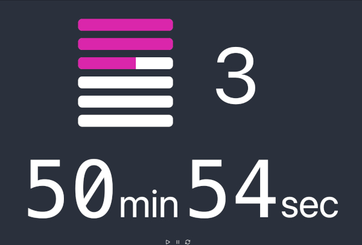

# Curling Game Timer

This is a Curling game timer to keep games on track during bonspiels. 

__This is NOT a thinking time clock.__



The above screenshot is an example of, “Finish the end you’re on and play two more”. The timer is set to 90 minutes (adjustable) to complete 6 ends (adjustable) of an 8 end game (adjustable). Progress bars show where games should be to stay on time. The screenshot is showing about halfway through the 3rd end. All settings are adjustable, so this far from the only option.


# How we’re using it

We’re using an old PC with Ubuntu 22.04 LTS installed as an appliance for running the timer. It’s not connected to the Internet. On startup it doesn’t require a login. Firefox browser is set to startup in kiosk mode. Turn the PC on, and the timer just appears.

The PC has two video ports to mirror two monitors. One monitor is with the PC in the warm room for the operator, the other monitor (65″ TV) is in the ice shed visible to the players. Since the TV is at the scoreboard end, we have CAT-6 running out to the TV and we use an HDMI over Ethernet Extender.

# Installation

If you’re looking for a Windows installer, this isn’t it. Be brave.

Install Docker Engine following the instructions for your operating system at https://docs.docker.com/engine/

Pull the compatible timer image from dockerhub.com:
```
pghcc/timer:amd64-<version> for Intel and AMD systems.
pghcc/timer:arm64-<version> for Apple Silicon and Raspberry PIs.
```

Instructions that follow are for Debian based Linux:

1. Pull version 0.1.0 of the Docker image down to your PC:
```bash
$ sudo docker pull pghcc/timer:amd64-0.1.0
```

2. Build the Docker container from version 0.1.0 of the image so it starts automatically on system boot:
```bash
$ sudo docker run -d --name timer -p 4001:4001 --restart unless-stopped pghcc/timer:amd64-0.1.0
```

3. Browse to http://localhost:4001 in your local browser to test.

4. Set Firefox as a startup application with the following command:
```bash
$ firefox –kiosk http://localhost:4001
```

# Roadmap

This application was initially conceived to be a hosted app, however the Pittsburgh Curling Club's Internet access is poor. The pipe is all bunged up during bonspiels. Hence, we run this app locally on a PC in the warm room.

A possible improvement would be setting it up to run remotely using Channels to control the timer through the Admin UI. This would allow installation on a remote computer (example: Raspberry PI) attached to the ice shed monitor. This would eliminate the need for an HDMI extender and allow WIFI access to the Admin UI from any computer in the building.

This application was written off-the-cuff so lacks tests. I never thought it would be used elsewhere. My bad.

Pull requests are welcome.

# Attribution

A big shout-out to Howard Griffin of the Potomac Curling Club for the initial idea.